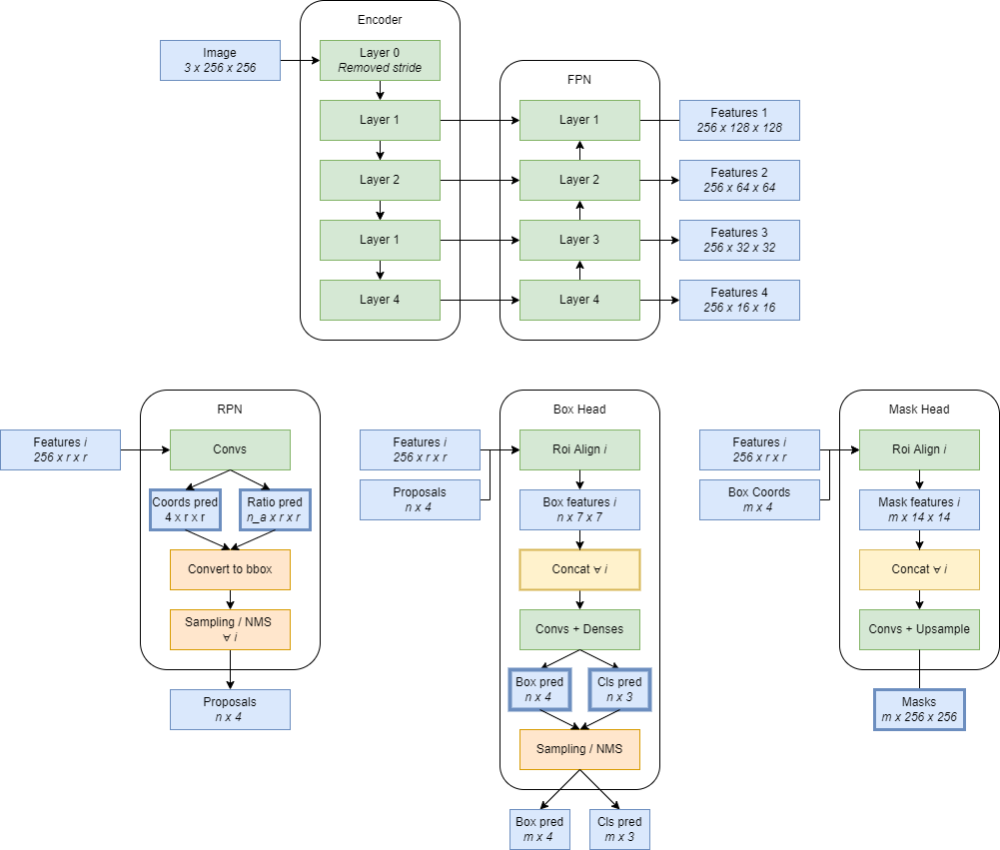

# 11th place solution to the Sartorius - Cell Instance Segmentation Kaggle Competition
#### Authors : [@theoviel](https://github.com/theoviel), [@optimox](https://github.com/Optimox)

#### Status :
- Document code : Done
- Clean notebooks : Approximately done
- Make ReadMe : Almost done


## Introduction


We only used machines with single RTX 2080 Ti so we had to be ingenious to be able to train on high resolution images and detect small cells. We used mask-rcnn based models and relied on mmdet but only for model definition and augmentations, the rest of the pipeline is hand-crafted, which made it more convenient for experimenting.



##### Main points
- Remove the stride of the first layer of the encoder to "increase the resolution" of the models without doing any resizing !
- Random Crops of size 256x256 for training
- Pretrain on Livecell
- 4000 iterations of finetuning on the training data
- Backbones : resnet50, resnext101_32x4, resnext101_64x4, efficientnet_b4/b5/b6
- Models : MaskRCNN, Cascade, HTC

##### Ensembling

We average predictions of different models & different flips at three stages, the stages are the boxes with thicker borders above.
- Proposals : For a given feature map output by the FPN, each of its pixel is assigned a score and a coordinates prediction by the convolutions. This is what we average. 
- Boxes : We re-use the ensembled proposal and perform averaging of the class predictions and coordinates for each proposal. We used 4 flip TTAs.
- Masks : starting with the ensembled boxes, we average the masks - before the upsampling back to the original image size.

This scheme doesn't really use NMS for ensembling which can be tricky to use. Hence we stacked a bunch of models. We used 6 models per cell type.

##### Post processing

- NMS on boxes using high thresholds, then NMS on masks using low thresholds
- Corrupt back the astro masks as we trained on clean ones (+0.002 LB)
- Small masks removal

We did a lot of hyper-parameters tweaking on CV : NMS thresholds, RPN and bbox_head params, confidence thresholds, minimum cell sizes, mask thresholds.

## How to use the repository

### Prerequisites

- Clone the repository
- Requirements :
  - mmdet v2.17
  - mmcv-full>=1.3.14, <1.4.0
  - Bunch of stuff that doesn't really matter as much
  - I use a custom version of the `fcn_mask_head.py` script : replace the one in  `mmdet/mmdet/models/roi_heads/mask_heads` with the one provided here.

- Download the data :
  - Put the competition data from [Kaggle](https://www.kaggle.com/c/sartorius-cell-instance-segmentation/data) in the `input` folder
  - Put [Heng's corrected masks](https://www.kaggle.com/hengck23/clean-astro-mask) in the `input/hck_fix` folder.
  - We also provide our trained model weights on Kaggle : [1](www.kaggle.com/theoviel/sartorius-cps-ens11), [1](www.kaggle.com/theoviel/sartorius-cps-ens10), [1](www.kaggle.com/theoviel/sartorius-cps-last)

- Prepare the data using `notebooks/Preparation.ipynb`. This should be quite fast to run but the multiprocessing may cause issues so you may want to get rid of it.

### Train models

- Pretrain models using `notebooks/Livecell.ipynb`
  - The first part of the notebook prepares the training csv, and only needs to be run once. Uncomment the line `# annotations = []  # do not recompute` to skip the preparation.

- For finetuning on the competition training data, you can either use `notebooks/Training.ipynb` or the scripts in `scripts/` which call the `main_training.py` script.
  - You can change main parameters by updating the `Config` class, the parameter naming should be straight-forward.
  - A bunch of training configs are provided with the weights above if you need inspiration for training models.

### Validate models [TODO]

Validate models with `notebooks/Inference.ipynb`.
Please refer to the [submission notebook](https://www.kaggle.com/theoviel/sartorius-inference-final) for performing inference on the test data.

## Code structure

If you wish to dive into the code, the repository naming should be straight-forward. Each function is documented.
The structure is the following :

```
src
├── configs
│   ├── config_aug_extra.py       # Data config with flip_paste augment
│   ├── config_aug_semantic.py    # Data config for htc models
│   ├── config_aug.py             # Default data config
│   ├── config_backbones.py       # Backbones definition
│   ├── config_cascade.py         # Cascade model config
│   ├── config_htc.py             # HTC model config
│   └── config.maskrcnn.py        # MaskRCNN model config
├── data
│   ├── dataset.py                # Torch datasets
│   ├── flip_paste.py             # Flip past augmentation
│   ├── loader.py                 # Dataloaders
│   ├── preparation.py            # Tools for data preparation
│   └── transforms.py             # Augmentations
├── inference           
│   ├── post_process.py           # Post processing functions
│   ├── predict.py                # Predict function
│   ├── tweaking.py               # To tweak parameters
│   └── validation.py             # Main file
├── model_zoo 
│   ├── custom_head_functions.py  # Modified mmdet function
│   ├── efficientnet.py           # EfficientNet backbone for mmdet
│   ├── ensemble.py               # Ensemble model
│   ├── merging.py                # To ensemble proposals / boxes / masks /
│   ├── models.py                 # Model definition
│   └── wrappers.py               # Ensemble wrappers
├── training           
│   ├── custom_loss.py            # Custom mmdet loss with decay
│   ├── main.py                   # k-fold and training main functions
│   ├── optim.py                  # Losses and optimizer handling
│   └── train.py                  # Fitting a model
├── utils           
│   ├── logger.py                 # Logging utils
│   ├── metrics.py                # Metrics for the competition
│   ├── plots.py                  # Plotting utils
│   ├── rle.py                    # RLE encoding utils
│   └── torch.py                  # Torch utils
├── get_log_folder.py             # Tool do get a new logging folder for training with scripts
├── main_training.py              # Main for training with scripts
└── params.py                     # Main parameters
``` 
